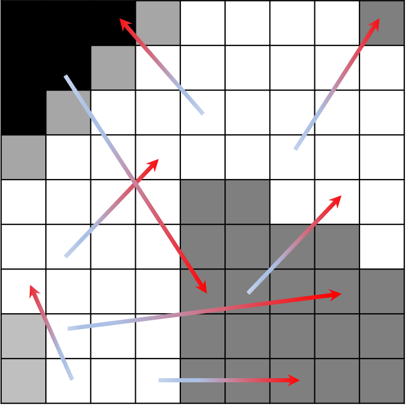
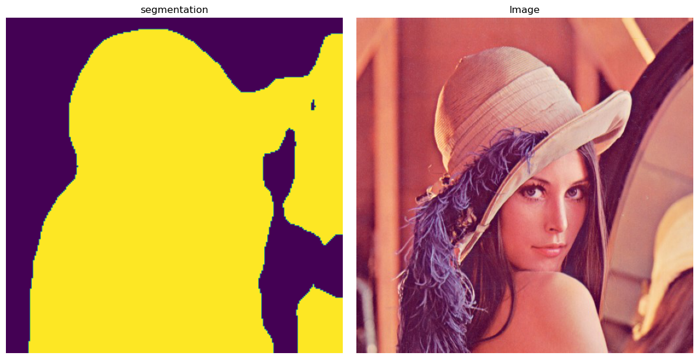
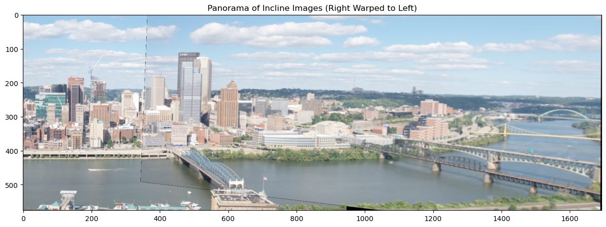

# Computer Vision Homework Assignments

Coding assignment for Algorithms and Applications in Computer Vision course.

## Assignment 1 - Features Descriptors

An implementation of keypoint detection and BRIEF, an interest point feature descriptor. Analysis of its performance with regard to illumination and rotation changes, and comparison to ORB.

  

## Assignment 2 - Image Classification

An implementation of classification models for the CIFAR-10 dataset.
This includes a classical classifier KNN, a Convolutional Neural Network (CNN) of our own implementation, and using the pre-trained CLIP model.

  

## Assignment 3 - Image Segmentation \& Homography

The first part is an exploration of image segmentation using the Watershed algorithm and ReSNet. 

  

The second part is an implementation of homography estimation, image warping and panorama stitching, as well as the RANSAC algorithm for better estimations.

  

## Assignment 4 - Structure from Motion

